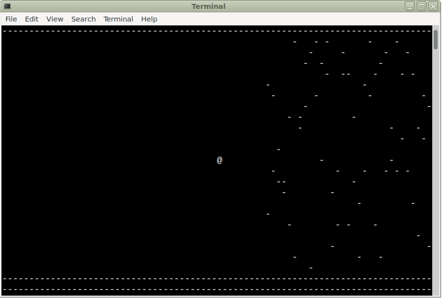

# AI, machine learning with neural network (Genetic algorithm)

Let's teach the little @ guy how to clear the obstacles, using neural network and genetic algorithm, in ~250 lines of classic ANSI C.



Before each step, the 'lookahead' function returns a snapshot of nearby obstacles that the little @ guy sees, this array is connected to 3 different actions (move up, move down, or don't change position) by a neural netowrk mesh. Based on how 'tight' the coupling is between each seen field ahead and the 3 actions (genes) the @ guy decides what action to take.
After a population is tested, the best performers (based on how far they advanced without bumping into an obstacle or hitting the wall) are selected to reproduce; also, some mutation is being introduced to each new generation, but plenty of non-mutated instances also remain, in order to adequately test out the winner genes of the previous generation.

The obstacle field is unique for each run, hence the algorithm (albeit slowly) comes up with a generally working solution rather than one for a specific obstacle field.

The algorithm also rewards (+25%) instances that complete their track by fewer up- or down movements.

To run, open a terminal and make sure its size is set to default 80 x 25
```
make clean ; make && ./aigame.bin
```

As soon as a generation demonstrates fitness by reaching a specific score, the algorithm increases the difficulty level by adding more obstacles to the field. However, at a certain difficulty level, the instances just don't have the capability to deal with the number and density of nearby obstacles. At this point, even the best instances with the best genes regress in performance, and the pool of good genes get lost. What doesn't kill you makes you stronger - but you cannot infinitely increase the load beyond one's capability.

