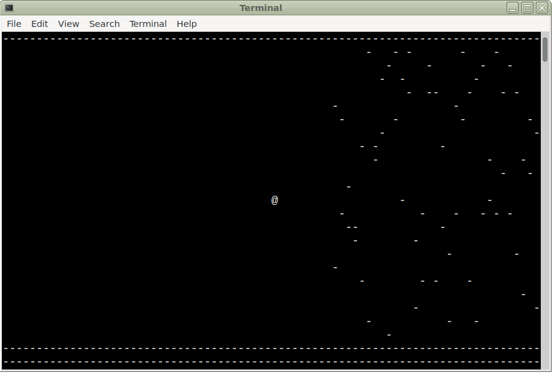

# Teaching a neural network through genetic algorithm

Let's teach the little @ guy how to navigate between the obstacles, using neural network and genetic algorithm, in ~250 lines of classic ANSI C.
(a greatly enhanced version of the same AI with deep learning and massive parallelism is [here](https://github.com/szoftveres/ai_ml/tree/main/big) )



Before each step forward, the 'lookahead' function returns a snapshot of nearby obstacles that the little @ guy sees, this vision field (the "stimulus") is connected to 3 different actions (move up, move down, or don't change position) by a neuron mesh. Based on the "genes" (individual neuron transmission factors between stimulus and actions), the @ guy decides what action to take.
After a population is tested, the best performers (based on how far they can advance without bumping into an obstacle or hitting the wall) are selected to reproduce; also, some mutation is being introduced to each new generation, but plenty of non-mutated instances also remain, in order to adequately test out the winner genes of the previous generation.

The obstacle field is unique for each run, hence the algorithm comes up with a generally working solution rather than one for a specific obstacle field (albeit slowly).

The algorithm can also be modified e.g. to promote less erratic behaviour by rewarding instances that complete their track with fewer up- or down movements.

To run, open a terminal and make sure its size is set to default 80 x 25 (the graphics are just rolling printf statements - in theory you could run this simulation on a PDP-11 with Teletype if you had enough paper to print on)
```
make clean ; make && ./aigame.bin
```

As soon as a generation demonstrates fitness by reaching a specific score, the algorithm increases the difficulty level by adding more obstacles to the field. However, at a certain difficulty level, the instances just don't have the capability to deal with the number and density of nearby obstacles. At this point, even the most fit instances with the best genes become average or poor performers, and the pool of previously good genes diminish over the subsequent few new generations. What doesn't kill you makes you stronger - but you cannot indefinitely increase the load beyond one's capability.
